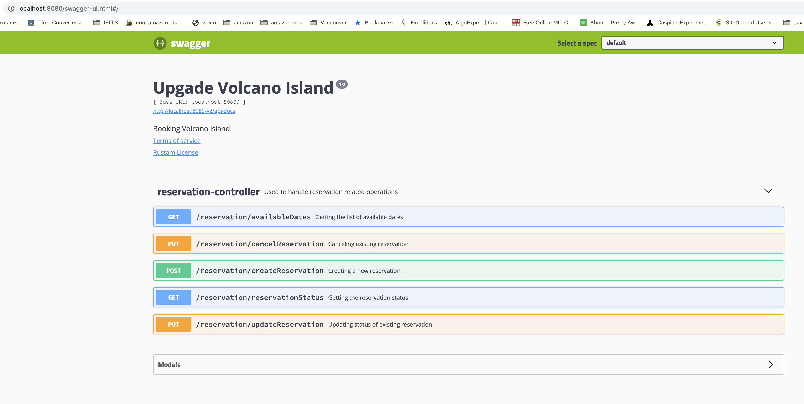
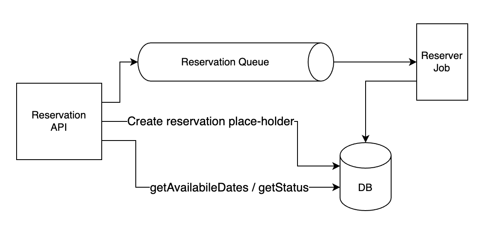
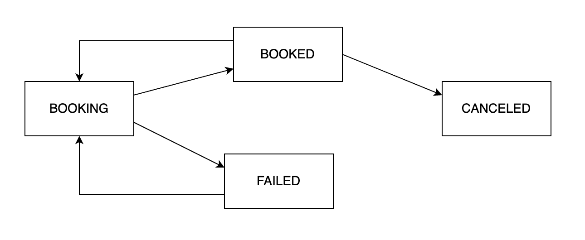

# Upgrade Volcano Island Reservation 

## Build and Test Project

`#gradle build`

## Run Project

`#gradle bootRun` or `#./gradlew bootRun`

http://localhost:8081/swagger-ui.html  is the good place to start. Swagger has very simple and intuitive way of requesting and working with API. (Postman or any other tool also can be used)

## High-Level Architecture

## Booking State Transition

## To Start Service with External Kafka broker on local machine

- download broker from [Kafka Page](https://kafka.apache.org/quickstart)
- inside the Kafka folder (after unzipping) run following commands:
    - start zookeeper: `bin/zookeeper-server-start.sh config/zookeeper.properties`
    - start kafka broker: `bin/kafka-server-start.sh config/server.properties`
    - create reservation topic: `bin/kafka-topics.sh --create --topic reserveTopic --bootstrap-server localhost:9092`
    - list out existing topics: `bin/kafka-topics.sh --list --bootstrap-server localhost:9092`
    

## H2 Database connection and checking
  - on browser go to: `http://localhost:8080/h2-console`
  - put `jdbc:h2:mem:testdb` for JDBC URL  
  - use `sa` as a password

## Backlog TODO List:
  - Controller "getListOfAvailableDates" is ugly
  - CRITICAL: `getListOfAvailableDates` is returning all dates
  - get rid of All System.out codes
  - `processReservation(resId)` may be moved to separate processor class
  - updateReservation dates are flacky
  - reservationId is selected as increasing 1 based ID (should be changed to UUID)
  - Kafka should be wrapped into a Generalized Queue Abstract Class